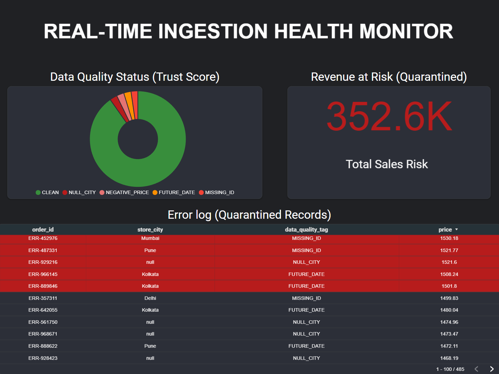
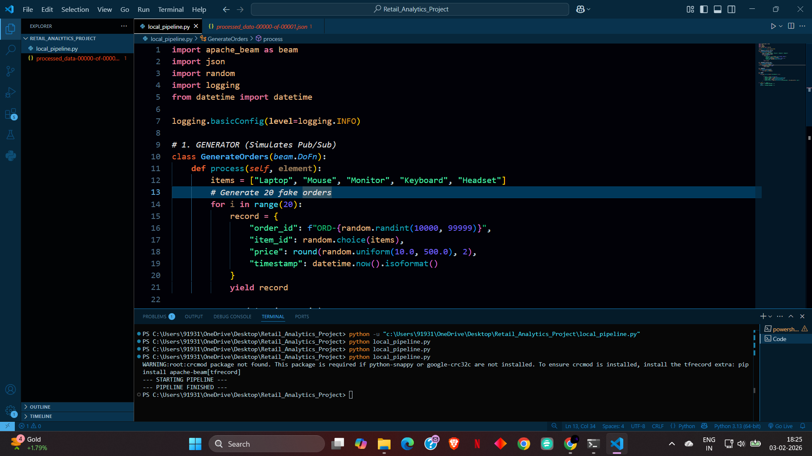
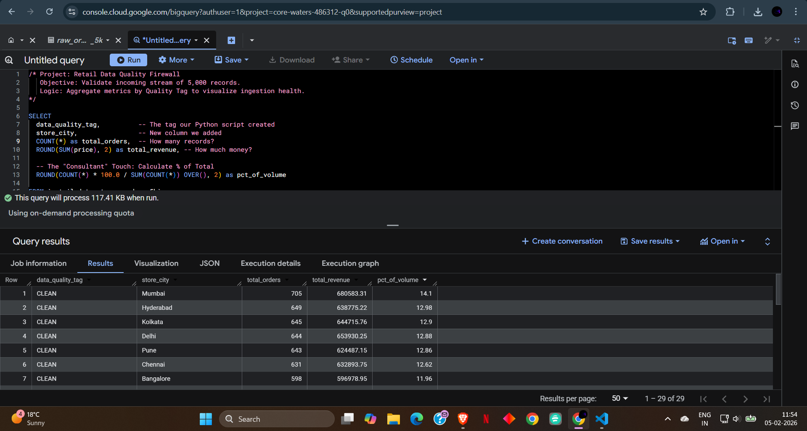

# Real-Time Retail Data Ingestion & Quality Monitoring Pipeline

## 📌 Project Overview
Designed and built an end-to-end data engineering pipeline to ingest, validate, and visualize retail transaction data. The system simulates real-time data generation, processes it using Python, loads it into Google BigQuery, and monitors data quality via a Looker Studio dashboard.

## 🛠️ Tech Stack
* **Language:** Python 3.13 (Scripting & Automation)
* **Database:** Google BigQuery (Data Warehousing & SQL)
* **Visualization:** Looker Studio (Risk Analysis Dashboard)
* **Concepts:** ETL, Data Quality Validation, Cloud Analytics

## 🚀 Key Features
* **Automated Data Generation:** Python script generates realistic retail transactions with edge cases (NULLs, Future Dates, Negative Prices).
* **Data Quality Tagging:** Implemented conditional logic to flag "Dirty Data" before analysis.
* **Business Intelligence:** Created a "Command Center" dashboard to visualize $350k+ in revenue risk.

## 📸 Project Screenshots

### 1. The Data Reliability Dashboard
*Visualizing "Revenue at Risk" and specific error logs for the engineering team.*


### 2. Pipeline Execution (Python)
*Script generating 5,000 records and processing them.*


### 3. BigQuery Storage
*Verified data loaded into Google Cloud with quality tags.*


## 💻 How to Run
1.  **Clone the repository:**
    ```bash
    git clone [https://github.com/srikar2520/Retail-Real-Time-Ingestion.git](https://github.com/srikar2520/Retail-Real-Time-Ingestion.git)
    ```
2.  **Install dependencies:**
    ```bash
    pip install google-cloud-bigquery pandas
    ```
3.  **Run the pipeline:**
    ```bash
    python pipeline.py
    ```
4.  **Verify in BigQuery:**
    Check the `retail_dataset.raw_orders` table to see the live data stream.
